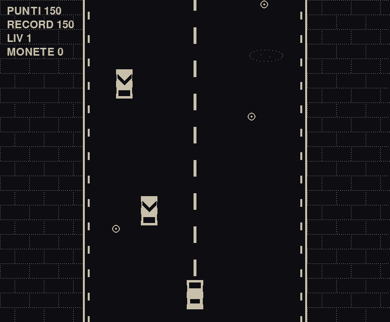

# Postazione Fiera — modifica il gioco con l'IA

A trade-fair / exhibition kiosk. A visitor picks one of four small Pygame games,
describes a change in plain Italian ("rendi l'auto più veloce", "aggiungi monete
d'oro", "fai comparire un secondo nemico"), and a headless **Claude Code** run
edits that game's source on the spot. They then play their version, undo, iterate,
and save it to a gallery. Each visitor gets a 30‑minute session working on their
own private copy of the game — the pristine templates are never touched.



## How it works

```
dashboard_app.py
  ├─ login: name + pick a game
  ├─ start_session(): copytree(game_templates/<game>  →  downwell_sessions/<stamp>_<game>_<name>/)
  ├─ main screen:
  │    "Gioca"            → runs the session's own copy of the game
  │    AI panel           → claude -p "<guardrails> <request>"  (cwd = session dir,
  │                          Read/Edit/Write/Glob/Grep only, acceptEdits, model sonnet)
  │    "Annulla"          → restores a pre-edit snapshot
  │    "Consiglio dell'IA"→ per-game analysis + 6 clickable suggestion prompts
  │  each edit: snapshot → run Claude → compileall the session dir → warn on syntax error
  └─ "Termina e Salva"    → copies the session to downwell_saved_games/ + a thumbnail
```

The AI engine is the **Claude Code CLI** (`claude`), using whatever account it is
logged in as on the kiosk machine — no API key handling in this app. Cost is
roughly **$0.09 per edit**.

## The four games (`game_templates/`)

| Folder | Name | Run | Notes |
|---|---|---|---|
| `downwell/` | Downwell | `downwell_clone.py` | Hand-built Downwell-like vertical shooter, 1‑bit look, plus three authoring tools (level / sprite / sound editors). Reads `DOWNWELL_DATA_DIR`. |
| `space_invaders/` | Space Invaders | `Code/Main.py` | Clear Code's tutorial Space Invaders, vendored; patched with a `GameOver` exception + an Italian restart overlay. |
| `platformer/` | Game of Crowns | `index.py` | A student Pygame platformer, retrofied in‑repo to a 1‑bit palette with an Italian end screen. |
| `racing/` | Corsa Retro | `race.py` | Original 1‑bit top‑down racer written for this kiosk — single file, no asset files. Dodge traffic, grab coins, near‑miss bonuses, oil slicks, crash juice, new‑record confetti. |

Each template folder also carries a generated `thumb.png` (card image) and
`ai_hints.json` (`{analysis, suggestions[6]}`, Italian).

## Running

```sh
pip install -r requirements.txt          # pygame + pillow
# install the Claude Code CLI and log in:  https://claude.com/claude-code
python dashboard_app.py
```

Python 3.10+. The dashboard needs a display; the games open in their own windows.

## Support scripts (one‑offs, re‑run when a template changes)

- `_game_shot.py <script> <out.png> <frames>` — render a Pygame game headless
  (`SDL_VIDEODRIVER=dummy`) and save the Nth frame. 30 s watchdog.
- `generate_thumbs.py` — write `thumb.png` into every template via `_game_shot.py`.
- `generate_hints.py [game_key …]` — have Claude Code read each template and
  write its `ai_hints.json`. ~$0.09 per game.

## Runtime data (git‑ignored)

- `downwell_sessions/` — per‑visitor working copies, plus `_undo/` snapshots.
- `downwell_saved_games/` — saved visitor creations, each with `session_meta.json`.

## Third‑party content

`game_templates/space_invaders/` is derived from Clear Code's Space Invaders
tutorial; `game_templates/platformer/` from a student platformer project. Their
bundled art / audio are the original authors'. This kiosk code (the dashboard,
the support scripts, `game_templates/racing/`, and the Downwell clone) is the
repo owner's.

---
🤖 Generated with [Claude Code](https://claude.com/claude-code)

https://claude.ai/code/session_01Qh1Vt5eAwX39zwnrJKVyF6
